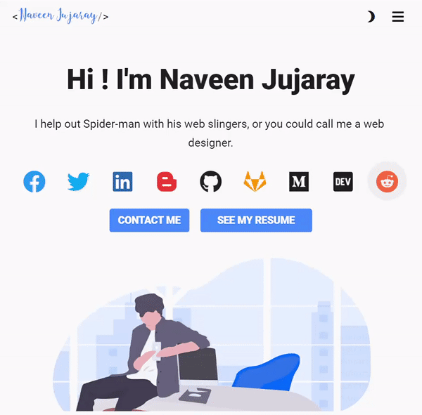

# DeveloperFolio   [](https://www.gnu.org/licenses/gpl-3.0) [](https://github.com/naveenjujaray/DeveloperFolio/stargazers)  [](https://developerfolio.web.app/) [](https://www.buymeacoffee.com/naveenjujaray)

A clean, beautiful and responsive portfolio template with `Dark Mode` enabled for Developers!

If you created something awesome and want to contribute then feel free to open Please don't hesitate to open an pull request.


### Dark Mode


### Desktop View


### Tablet View


### Mobile View


## Sections

✔️ Summary and About me

✔️ Skills

✔️ Proficiency

✔️ Education

✔️ Achievements 🏆

✔️ Blogs

✔️ Contact me

To view a live example, [click here]

## Getting Started

From your command line, clone and run developerFolio:

In-order to work with this repo you need to have `flutter beta` installed on your system.

```
# Clone this repository
$ git clone 

# Go into the repository
$ cd DeveloperFolio

# Get Packages
$ flutter pub get

# Build Web using Flutter
$ flutter build web

# Launch/View
$ flutter run -d chrome
```

## Deployment 📦

When you are done with the setup, you should host your website online. We highly recommend to read through the docs for [Firebase] Hosting.

```
# Before you can install the Firebase CLI, you will need to install Node.js on your machine.
npm install -g firebase-tools

# Firebase Login
$ firebase login

# Initialize Firebase
$ firebase init

# Deploy to Firebase
$ firebase deploy

```

## For the Future
* Connect with LinkedIn to get Summary, Skills, Education and Experience
* Connect with Github to get Customized Pins, Profile Details
* Personalization Page to edit everything in once place.


[Firebase]: https://firebase.google.com/docs/hosting/quickstart
[click here]: https://developerfolio.web.app/
